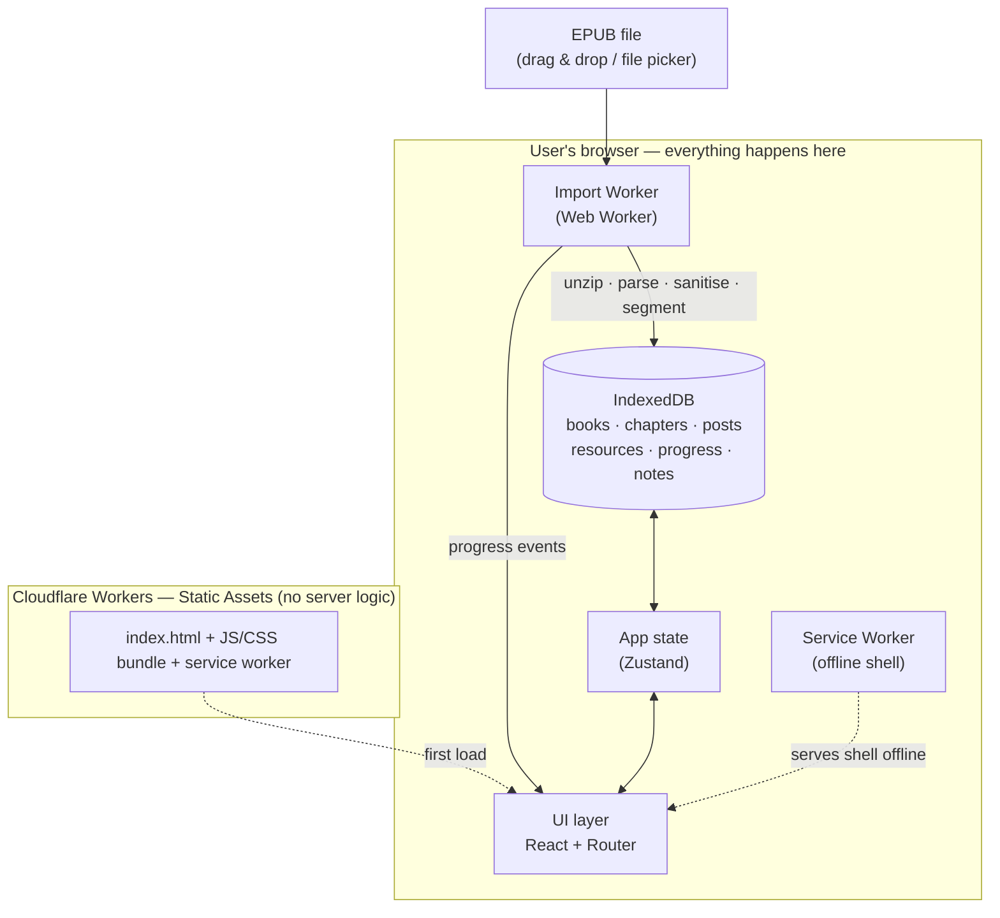
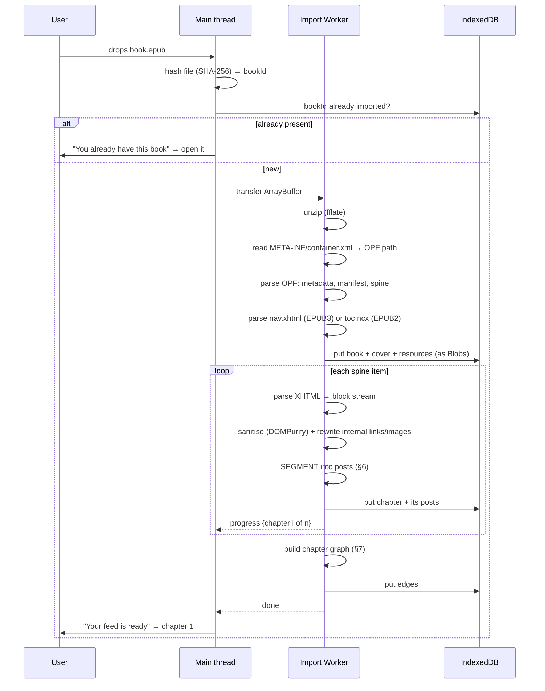

# book-to-feed — Architecture Proposal

> **Status:** Accepted as the plan of record. M0 (skeleton, CI, deployment) is built; M1 is next.
> The open decisions in §14 are still open — see [#7](https://github.com/xSakix/book-to-feed/issues/7).
> **Scope of this document:** the full client-side web application (v1).

---

## 1. The product in one paragraph

You drop an EPUB into a web page. The page tears the book apart in your browser and rebuilds it
as a social network. Every **chapter becomes an account** with its own profile and its own **feed**.
Every **paragraph-cluster becomes a post**. You read a chapter by scrolling its feed top to bottom,
exactly like doom-scrolling — except when you hit the bottom you don't hit ads, you hit the
**next chapter suggested to you as a friend**. Chapters are connected to each other like people are:
neighbours in the spine are close friends, chapters that link to each other have "mentioned" each
other, chapters sharing characters are "people you may know". The whole book is a small social
graph you walk through by reading.

Nothing leaves the device. There is no backend.

---

## 2. Design principles (these drive every decision below)

1. **Fully local, zero-server.** The EPUB is parsed, stored and rendered in the browser. Books are
   often personal, sometimes legally grey; shipping them to a server is a liability we simply
   refuse to take on. This also makes the app free to host and trivially offline-capable.
2. **The chapter boundary is a feature, not a limitation.** We deliberately do _not_ build one
   endless scroll through the whole book. Finishing a feed is the reward loop. Endless scroll
   removes the sense of completion that makes the metaphor work.
3. **Segmentation quality is the product.** Everything else — the UI, the graph, the storage — is
   ordinary engineering. Whether a post ends on a good beat is what makes this feel magical or
   feel like a text file cut with scissors. It gets its own engine, its own tests, its own version
   number (§6).
4. **Deterministic and re-derivable.** Same book + same segmenter version → byte-identical posts.
   Reader data (progress, highlights, notes) is anchored to _positions in the source XHTML_, not to
   post indexes, so we can improve the segmenter later without destroying anyone's reading history.
5. **The book is untrusted input.** EPUBs are ZIPs full of arbitrary XHTML, CSS and JavaScript.
   Every byte is sanitised before it goes near the DOM (§9).
6. **Reading is still the point.** The social skin must never make the text harder to read.
   A one-tap "Reader mode" always exists that flattens the feed back into a normal chapter.

---

## 3. High-level architecture



**The EPUB never crosses the network.** The only network traffic is the initial download of the app
shell, which the service worker then caches.

---

## 4. Technology choices

| Concern        | Choice                                          | Why this and not the obvious alternative                                                                                                                                                                                                                                                |
| -------------- | ----------------------------------------------- | --------------------------------------------------------------------------------------------------------------------------------------------------------------------------------------------------------------------------------------------------------------------------------------- |
| Build          | **Vite + TypeScript**                           | Fast, static output, first-class worker bundling (`new Worker(new URL(...))`).                                                                                                                                                                                                          |
| UI             | **React 19**                                    | Boring on purpose. Concurrent rendering helps with long virtualised lists. Preact is a drop-in fallback if bundle size ever becomes a problem.                                                                                                                                          |
| Routing        | **React Router (data mode)** with SPA fallback  | Deep-linkable chapters & posts.                                                                                                                                                                                                                                                         |
| State          | **Zustand**                                     | The app has little global state (current book, current chapter, settings). Redux is overkill; context alone re-renders too much for a virtualised feed.                                                                                                                                 |
| Styling        | **Tailwind CSS v4** + CSS variables for theming | Social UIs are dense in one-off layout; utility classes suit that. CSS variables let us theme light/dark/sepia without rebuilding.                                                                                                                                                      |
| Unzip          | **`fflate`**                                    | ~8 KB, synchronous inflate, works inside a worker. `JSZip` is 3× the size and slower.                                                                                                                                                                                                   |
| EPUB parsing   | **Our own parser** over `DOMParser`             | _Deliberately not `epub.js`._ epub.js is built to **paginate** and renders chapters inside sandboxed iframes. We need the opposite: the raw semantic block tree so we can re-cut it. Using epub.js would mean fighting it constantly. Our parser is ~400 lines for OPF + NCX + nav-doc. |
| Sanitising     | **DOMPurify**                                   | Battle-tested. Configured to an allow-list (§9).                                                                                                                                                                                                                                        |
| Storage        | **IndexedDB via `idb`**                         | Blobs (images, covers) plus thousands of post records plus range queries. localStorage caps at ~5 MB and is synchronous — not an option. `idb` is a thin promise wrapper; Dexie adds a query layer we don't need.                                                                       |
| Virtualisation | **`@tanstack/react-virtual`**                   | A chapter can be 300 posts with images; mounting all of them kills mobile scroll. Dynamic measurement is required because post heights vary wildly.                                                                                                                                     |
| Testing        | **Vitest** + **Playwright**                     | Vitest for the segmenter's golden-file tests; Playwright for import→read→resume flows against real public-domain EPUBs.                                                                                                                                                                 |
| Hosting        | **Cloudflare Workers Static Assets**            | `wrangler deploy`, SPA fallback, immutable asset hashing, custom headers. Leaves the door open for a _tiny_ optional Worker later (e.g. OG share-card images) without changing platforms.                                                                                               |

---

## 5. The import pipeline

A 500-page novel is ~2–3 MB of XHTML and can be 50 MB with images; inflating that on the main
thread would freeze the UI for seconds. So the **decompression runs in a Web Worker**, which is
where the CPU cost actually is, and the caller drives the pipeline entry by entry.

> **Revised during M1.** This section originally had the worker do everything — unzip, parse,
> sanitise, store. That is not implementable: `DOMParser` and DOMPurify both need a DOM, and
> `WorkerGlobalScope` has none. The alternatives were to hand-roll an XML parser and an HTML
> sanitiser inside the worker, or to keep the DOM work on the main thread. Writing our own
> sanitiser is precisely the wrong thing to do for the one component whose job is to stop a
> malicious book executing script, so the split is:
>
> - **Worker** — holds the archive bytes, inflates entries on demand (`src/workers/unzip.worker.ts`).
> - **Main thread** — parses OPF/TOC/XHTML, sanitises, writes to IndexedDB, yielding to the event
>   loop every few chapters so the progress bar keeps painting.
>
> Both sides sit behind the `ArchiveReader` interface, so the parsers are identical either way and
> the whole pipeline runs synchronously in unit tests. Nothing unsanitised is still ever stored.



**Notes**

- `bookId = SHA-256(file bytes)` via WebCrypto. Re-importing the same file is idempotent and
  preserves reading progress.
- Images and CSS are stored as **Blobs**, not base64 (base64 costs +33 % and blocks the main thread
  on decode). At render time we mint `URL.createObjectURL` lazily and revoke on unmount.
- Original book CSS is **parsed for hints but never applied wholesale.** We extract a few signals
  (is this class italic? is it centred? is it a verse block?) and then style everything with our own
  design system. Applying publisher CSS would destroy the social-feed look.
- Target: **< 10 s** for a typical novel on a mid-range phone, with visible per-chapter progress.

---

## 6. The segmentation engine (the heart of the app)

### 6.1 Stage 1 — XHTML → block stream

Walk the sanitised chapter DOM and flatten it to an ordered array of typed blocks, each carrying its
source anchor (`{ blockIndex, charStart, charEnd }`):

`heading` · `paragraph` · `dialogue` (paragraph opening with `"` `'` `«` `—`) · `blockquote` ·
`verse` (`<pre>`, poetry classes, `<br>`-dense) · `list` · `image` (with `alt`/`figcaption`) ·
`table` · `code` · `sceneBreak` (`<hr>`, or a short centred paragraph of `* * *` / `#` / `~`) ·
`footnoteRef` · `pageBreak` (ignored — print artefact).

### 6.2 Stage 2 — block stream → posts

A greedy accumulator with a scored break decision. Budgets are configurable per **post density**
setting (Compact / Normal / Roomy):

| Parameter  | Default (Normal)                            |
| ---------- | ------------------------------------------- |
| `TARGET`   | 650 characters                              |
| `SOFT_MAX` | 1 100 characters                            |
| `HARD_MAX` | 1 600 characters                            |
| `MIN`      | 180 characters (below this, keep absorbing) |

**Hard rules (non-negotiable, applied before scoring):**

- A `heading` always starts a new post and stands alone → renders as the chapter's "pinned post".
- `image`, `table` and `code` are always their own post.
- `sceneBreak` always forces a break and renders as a divider card.
- A paragraph is **never split** unless it alone exceeds `HARD_MAX`, in which case it is split at
  sentence boundaries (Intl.Segmenter with `granularity: 'sentence'`, falling back to a regex),
  and the continuation post is marked `isContinuation` so the UI can hide the avatar/header and
  visually weld it to the previous one.

**Soft scoring — once accumulated length ≥ `TARGET`, break here unless a bonus says wait:**

```
score(breakAfter block B, next block N) =
    + 3.0  if B's text ends with . ! ? … " ' » — (a real sentence end)
    + 2.0  if B ends with ? or ! or …            (cliffhanger beat)
    + 1.5  if N is a heading, image, or sceneBreak (natural boundary ahead)
    - 4.0  if B is dialogue AND N is dialogue     (never cut an exchange in half)
    - 3.0  if B is a one-line paragraph (< 80 chars) and N continues the same speaker
    - 2.0  if B ends mid-clause (ends with , ; : — or a conjunction)
    - 1.5  if N is a blockquote/verse that clearly belongs to B (B ends with :)
    - 5.0  if resulting post length < MIN
    + 0.02 × (length − TARGET)                    (pressure grows past target)

break when score > 0, or unconditionally when length ≥ HARD_MAX
```

The scoring exists for one reason: **a post should end on a beat.** The difference between
"…she opened the door." and "…she opened the" is the difference between a product and a toy.

### 6.3 Stage 3 — post enrichment

Each post gets: `readingSeconds` (chars ÷ 900 chars-per-minute, floored at 3 s), a `pullQuote`
candidate (the strongest sentence, for share cards), and its anchor range.

### 6.4 Versioning & migration

Posts are stamped with `segmenterVersion`. When we ship a better segmenter, re-segmentation is
triggered lazily per book and **reader data is remapped by anchor**, not by post index:
a highlight at `{block: 41, char: 120}` finds whichever new post contains that offset. This is why
anchors exist and why progress is stored as an anchor, not a scroll position.

### 6.5 How we know it works

Golden-file tests over a fixture set of public-domain EPUBs (Gutenberg: a novel, a poetry
collection, a play, a non-fiction book with tables, an EPUB 2 file, an RTL file). Assertions:
no post exceeds `HARD_MAX`; no post below `MIN` except the last of a chapter; no dialogue exchange
split; ≥ 85 % of posts end at a sentence boundary; segmentation is byte-stable across runs.

---

## 7. The social layer

### 7.1 The metaphor mapping

| Social network concept            | book-to-feed meaning                                                                    |
| --------------------------------- | --------------------------------------------------------------------------------------- |
| **Account / profile**             | A **chapter**                                                                           |
| Display name                      | Chapter title (falls back to "Chapter 7")                                               |
| Avatar                            | The chapter's first image, else a deterministic generated identicon seeded by the title |
| Bio                               | First sentence of the chapter + "%d posts · ~%d min read"                               |
| **Feed / wall**                   | That chapter's ordered posts                                                            |
| **Post**                          | A snippet (§6)                                                                          |
| Post timestamp                    | In-book position: "post 12 of 84" / "≈ 4 min into the chapter"                          |
| **Stories bar** (top)             | The chapter list. Unread = bright ring, in-progress = partial ring, read = grey         |
| **Friends**                       | Related chapters (§7.2)                                                                 |
| **Friend request / "Add friend"** | The end-of-chapter card that unlocks the next chapter's feed                            |
| **Mentions / tags**               | Chapters that hyperlink to each other inside the EPUB                                   |
| **Mutual friends**                | Chapters sharing prominent named entities                                               |
| **Like / reactions**              | Reader reactions on a post (local only)                                                 |
| **Comments**                      | The reader's own margin notes on a post                                                 |
| **Saved / bookmarks**             | Highlights                                                                              |
| **Share**                         | Rendered quote card (canvas → PNG) or copied text + attribution                         |
| **Notifications**                 | "You've unlocked Chapter 4", reading streaks, "you're 60 % through the book"            |
| **The author**                    | The book's own profile — the "page" all chapters belong to                              |

### 7.2 The chapter graph

Edges are derived at import time and stored in IndexedDB:

| Edge type           | Derived from                                                            | Presented as                                  |
| ------------------- | ----------------------------------------------------------------------- | --------------------------------------------- |
| `sequential`        | Spine adjacency                                                         | "Close friend" — always the primary next/prev |
| `sibling`           | Same parent node in the TOC (same Part/Book)                            | "Family"                                      |
| `mentions`          | An `<a href>` from chapter A into chapter B's file                      | "A mentioned B"                               |
| `mutualMention`     | Links in both directions                                                | "Mutual friends"                              |
| `references`        | Footnote/endnote targets                                                | "Tagged you in a note"                        |
| `sharedCast` _(v2)_ | Overlap of prominent capitalised entities, TF-IDF-weighted, stop-listed | "People you may know"                         |

`sharedCast` is heuristic, language-dependent and easy to get wrong — it is explicitly **v2**, is
computed lazily, and is presented as a soft suggestion, never as navigation the reader depends on.

### 7.3 The reading loop

```
Library  →  Book profile  →  Chapter feed  →  (scroll to end)  →  "Next chapter wants to
connect"  →  Chapter feed  →  …  →  Book finished card
```

Reaching the end of a chapter feed is the only ceremony in the app: a completion card showing what
you just read, your reactions on it, and the next chapter presented as an incoming friend request.
Free navigation (jump to any chapter) is always available from the stories bar — we gate _ceremony_,
never _access_.

---

## 8. Data model (IndexedDB, database `book-to-feed`, version 1)

| Store          | Key                                 | Contents                                                                                                                                     | Indexes                |
| -------------- | ----------------------------------- | -------------------------------------------------------------------------------------------------------------------------------------------- | ---------------------- |
| `books`        | `bookId` (sha256)                   | title, authors, language, publisher, description, coverBlob, spine[], addedAt, lastOpenedAt, segmenterVersion, stats                         | `by-lastOpened`        |
| `chapters`     | `[bookId, index]`                   | title, href, order, tocDepth, parentIndex, **html** (sanitised), postCount, charCount, readingSeconds, avatarSeed                            | `by-book`              |
| `posts`        | `[bookId, chapterIndex, postIndex]` | type, html (sanitised), plainText, anchor `{blockStart, charStart, blockEnd, charEnd}`, charCount, readingSeconds, isContinuation, pullQuote | `by-chapter`           |
| `resources`    | `[bookId, href]`                    | mediaType, blob                                                                                                                              | —                      |
| `edges`        | `[bookId, from, to, type]`          | weight                                                                                                                                       | `by-from`              |
| `progress`     | `bookId`                            | currentChapter, currentAnchor, per-chapter `{state, furthestAnchor, completedAt}`, streak, totalSecondsRead                                  | —                      |
| `interactions` | auto-increment                      | bookId, chapterIndex, anchor, kind (`reaction`\|`note`\|`highlight`), payload, createdAt                                                     | `by-book`, `by-anchor` |
| `settings`     | fixed key                           | theme, fontFamily, fontScale, postDensity, reduceMotion, readerModeDefault                                                                   | —                      |

**Added during M1:** `chapters.html` was not in the original table. M2 needs cleaned markup to build
its block stream, and re-deriving it would mean keeping the whole archive and re-sanitising on every
segmenter change. Storing it keeps the rule that nothing unsanitised is ever persisted.

**Storage strategy.** Call `navigator.storage.persist()` on first import so the browser doesn't
evict a user's library under pressure, and surface `navigator.storage.estimate()` in Settings with
a per-book size breakdown and a "remove book / keep progress" action (deletes `resources` + `posts`,
keeps `books` + `progress` + `interactions`, so a re-import restores everything).

**Export/import.** Because there is no account, a JSON export of `progress` + `interactions`
(keyed by `bookId`, so it re-attaches when the same file is re-imported) is the only migration path
between devices. Ships in v1 — without it, clearing site data is catastrophic and irreversible.

---

## 9. Security & privacy

An EPUB is an untrusted archive. Threat: a crafted book executing script in our origin and reading
the reader's entire library out of IndexedDB.

- **Sanitise everything** with DOMPurify before storage _and_ trust nothing at render: no `<script>`,
  no `<iframe>`, no `<object>`/`<embed>`, no `on*` handlers, no `javascript:` URLs, no `<style>` or
  inline `style` beyond an allow-list (`font-style`, `font-weight`, `text-align`, `text-indent`).
- **Rewrite all URLs.** `src`/`href` pointing inside the archive → internal resource references
  resolved to Blob URLs at render. Anything pointing outside → rendered as inert text, never as a
  live external request (a remote image is a tracking pixel telling a third party what you read and
  when).
- **CSP** delivered as a response header from Cloudflare:
  `default-src 'self'; img-src 'self' blob: data:; script-src 'self'; style-src 'self' 'unsafe-inline';
connect-src 'self'; frame-ancestors 'none'; base-uri 'none'; object-src 'none'`.
- **No analytics, no telemetry, no fonts from a CDN.** Fonts are self-hosted. The privacy claim
  ("your books never leave your device") must be literally true and verifiable in the network tab.
- **DRM'd EPUBs are out of scope.** Adobe ADEPT / LCP files are detected (`META-INF/encryption.xml`,
  `rights.xml`) and rejected with a clear message. We do not strip DRM.

---

## 10. Rendering & UX

- **Virtualised feed** via `@tanstack/react-virtual` with dynamic measurement; only mounted posts
  hold Blob URLs, revoked on unmount.
- **Scroll restoration by anchor**, not pixel offset — survives font-size changes, orientation
  changes and re-segmentation.
- **Reader mode toggle** on every chapter: concatenates the same posts into continuous prose with
  normal typography. This is both an accessibility requirement and an escape hatch for fixed-layout
  or poetry books where the feed metaphor works badly.
- **Accessibility.** The feed is a `<main>` with each post an `<article>` in a labelled list;
  headings preserve document order so screen-reader users get a coherent chapter. Full keyboard
  navigation (`j`/`k` post, `n` next chapter, `/` search). Respect `prefers-reduced-motion` and
  `prefers-color-scheme`. Font scale 80–200 %, optional dyslexia-friendly face. Target WCAG 2.2 AA.
- **PWA.** Installable, offline after first load; a book already imported is fully readable on a
  plane. The service worker caches only the app shell — book data is already local.
- **Mobile-first.** Thumb-reachable controls, snap-free natural scrolling, tap-to-react.

### Routes

| Route                           | Screen                                                             |
| ------------------------------- | ------------------------------------------------------------------ |
| `/`                             | Library (imported books, continue reading)                         |
| `/import`                       | Drop zone + import progress                                        |
| `/b/:bookId`                    | Book profile — "the author's page", chapter grid, overall progress |
| `/b/:bookId/c/:chapter`         | **The chapter feed**                                               |
| `/b/:bookId/c/:chapter/p/:post` | Deep link to a post (share targets)                                |
| `/b/:bookId/graph`              | The chapter friend graph, visualised                               |
| `/settings`                     | Theme, typography, density, storage, export/import                 |

---

## 11. Deployment

Static assets only — **no server code in v1.**

```jsonc
// wrangler.jsonc
{
  "name": "book-to-feed",
  "compatibility_date": "2026-01-01",
  "assets": {
    "directory": "./dist",
    "not_found_handling": "single-page-application",
  },
}
```

- `npm run build` → `dist/` → `wrangler deploy`.
- GitHub Actions: PR → typecheck + lint + unit tests + Playwright; merge to `main` → deploy.
- Security headers via `public/_headers` (CSP from §9, `X-Content-Type-Options`, `Referrer-Policy: no-referrer`).
- Hashed asset filenames get `immutable` caching; `index.html` and the service worker do not.

### Repository layout

```
src/
  app/            routes, shell, providers
  features/
    library/      import UI, book list
    feed/         virtualised feed, post cards, end-of-chapter card
    profile/      chapter & book profiles, stories bar
    graph/        chapter friend graph
    social/       reactions, notes, highlights, share cards
  core/
    epub/         container/OPF/NCX/nav parsing, resource resolution
    segment/      block extraction + the segmentation engine   ← most-tested code
    db/           IndexedDB schema, migrations, queries
    sanitize/     DOMPurify config, URL rewriting
  workers/        import.worker.ts
  ui/             design system primitives
tests/
  fixtures/       public-domain EPUBs
  golden/         expected segmentation snapshots
```

---

## 12. Delivery plan

| Milestone             | Deliverable                                                                               | Definition of done                                                       |
| --------------------- | ----------------------------------------------------------------------------------------- | ------------------------------------------------------------------------ |
| **M0 — Skeleton**     | Vite/TS/React scaffold, CI, Cloudflare deploy, design tokens                              | A blank themed app is live on a URL                                      |
| **M1 — Import**       | fflate + OPF/NCX/nav parser, sanitiser, worker, IndexedDB, library screen                 | Drop an EPUB → see chapters listed with cover, metadata and progress     |
| **M2 — Segmenter**    | Block extraction + scoring engine + golden tests                                          | Fixture books segment within budget and pass the §6.5 assertions         |
| **M3 — The feed**     | Virtualised feed, post cards, anchored progress, end-of-chapter card, chapter→chapter nav | A whole novel is readable end to end, resumes exactly where you left off |
| **M4 — Social layer** | Chapter profiles, stories bar, friend graph, reactions/notes/highlights, share cards      | The metaphor in §7.1 is fully present                                    |
| **M5 — Polish**       | PWA/offline, reader mode, a11y pass, themes & typography, export/import, storage manager  | WCAG 2.2 AA pass; works offline; data is portable                        |

M1–M3 are the walking skeleton — after M3 the app is genuinely usable and everything after is
enrichment.

---

## 13. Risks and things I want to flag before we build

1. **Segmentation quality is the whole bet.** The scoring weights in §6.2 are an informed starting
   point, not truth. They will need tuning against real books, and non-fiction / poetry / plays
   behave very differently from novels. Mitigation: the golden-test harness in M2 lets us tune
   quickly and see regressions; post density is user-adjustable.
2. **Fixed-layout EPUBs** (comics, children's books, heavily designed non-fiction) fit this metaphor
   badly. Detect `rendition:layout="pre-paginated"` and route those books straight to reader mode
   with an honest explanation rather than producing a broken feed.
3. **Losing the library is silent and total.** "Clear site data" wipes everything. `persist()` plus
   the v1 export path are the mitigation; the UI should say plainly that data is device-local.
4. **Memory on large books.** A 100 MB illustrated EPUB held as one ArrayBuffer plus its inflated
   contents can OOM a low-end phone. Mitigation: unzip entry-by-entry, write to IDB as we go, never
   hold all inflated chapters at once, and cap in-flight Blob URLs.
5. **Non-Latin and RTL text.** Sentence-boundary detection via `Intl.Segmenter` handles most of it;
   RTL needs `dir` propagation from the OPF and mirrored layout. CJK needs a character-based length
   budget, not a byte- or Latin-word-based one — CJK posts would otherwise be ~3× too long.
6. **The "friends" metaphor can over-promise.** `sharedCast` in particular will produce wrong,
   occasionally spoiler-y suggestions ("this chapter knows a character you haven't met yet"). It
   stays v2, opt-in, and must never surface entities from chapters ahead of the reader.
7. **Spoilers generally.** Chapter titles and first-sentence bios are shown in the stories bar and
   friend cards — in some books, that itself is a spoiler. Propose a "blur unread chapter titles"
   setting, default on for fiction.

---

## 14. Open decisions for you

These change what gets built and I'd like your call before M1:

1. **Post density default** — Compact (~400 chars, very Instagram) vs Normal (~650) vs Roomy (~900,
   closer to a real page)? My recommendation: **Normal**, user-adjustable.
2. **Chapter gating** — is the next chapter always freely reachable from the stories bar (my
   recommendation), or should finishing a chapter be required to "unlock" the next one?
3. **Reactions vocabulary** — generic (👍 ❤️ 😂 😮 😢 😡) or reading-specific
   (📖 "beautiful line", 🤯 "plot twist", 😭 "this hurt", 🔖 "remember this")? I lean
   reading-specific; it makes the highlights view far more useful later.
4. **v1 scope of the friend graph** — ship §7.2 without `sharedCast` (spine + TOC + hyperlinks only,
   fully deterministic), or attempt entity extraction in v1?
5. **Multi-book library vs one book at a time.** The data model supports many; the UI is simpler
   with one. My recommendation: build the model as specified, ship a minimal library screen.

---

## 15. Explicitly out of scope for v1

Accounts, sync, sharing between users, comments from other people, DRM removal, PDF/MOBI/AZW3
import, text-to-speech, translation, AI-generated summaries or character extraction beyond §7.2,
and any server-side component whatsoever.
